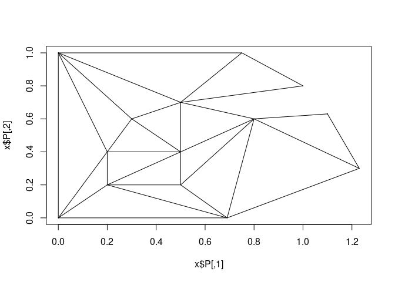
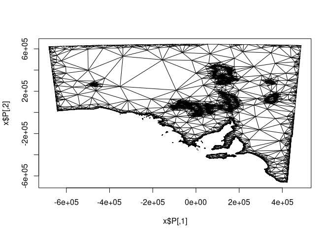

<!-- README.md is generated from README.Rmd. Please edit that file -->

# wkmesh

<!-- badges: start -->
<!-- badges: end -->

The goal of wkmesh is to explore methods of creating meshes, we might
move on from silicate/anglr, but at least we want to avoid dealing with
formats, leverage wk/geos, and get a firmer basis for this.

We triangulate from edges but we don’t currently trim holes or maintain
identity of input features (use anglr or silicate with sf objects for
now).

## Installation

I wouldn’t. Nothing is exported, mostly I’m just leaving a trail for
myself (indexing for meshes can be tricky and I only have informal
methods. The main workhorse is {unjoin} and I’d like to expand out why
that’s so easy to use and how to use other methods).

``` r
# FILL THIS IN! HOW CAN PEOPLE INSTALL YOUR DEV PACKAGE?
```

## Example

This is a basic example:

``` r
devtools::load_all()
#> ℹ Loading wkmesh
library(wkmesh)
library(wk)
library(dplyr, warn.conflicts = FALSE)
library(silicate)
#> 
#> Attaching package: 'silicate'
#> 
#> The following object is masked from 'package:stats':
#> 
#>     filter
g <- wk::as_wkb(minimal_mesh)
#> old-style crs object detected; please recreate object with a recent sf::st_crs()

system.time({

x <- edges_vctrs(g)
})
#>    user  system elapsed 
#>   0.030   0.000   0.029

system.time({

x <- edges_unjoin(g)
})
#>    user  system elapsed 
#>   0.034   0.000   0.034

# system.time({
#   sc <- SC0(inlandwaters)
# })

#plot(sc)
(el <- edge_linestring(x))
#> <wk_wkb[16] with CRS=NA>
#>  [1] <LINESTRING (0 0, 0 1)>           <LINESTRING (0 1, 0.75 1)>       
#>  [3] <LINESTRING (0.75 1, 1 0.8)>      <LINESTRING (1 0.8, 0.5 0.7)>    
#>  [5] <LINESTRING (0.5 0.7, 0.8 0.6)>   <LINESTRING (0.8 0.6, 0.69 0)>   
#>  [7] <LINESTRING (0.69 0, 0 0)>        <LINESTRING (0.2 0.2, 0.5 0.2)>  
#>  [9] <LINESTRING (0.5 0.2, 0.5 0.4)>   <LINESTRING (0.5 0.4, 0.3 0.6)>  
#> [11] <LINESTRING (0.3 0.6, 0.2 0.4)>   <LINESTRING (0.2 0.4, 0.2 0.2)>  
#> [13] <LINESTRING (0.69 0, 0.8 0.6)>    <LINESTRING (0.8 0.6, 1.1 0.63)> 
#> [15] <LINESTRING (1.1 0.63, 1.23 0.3)> <LINESTRING (1.23 0.3, 0.69 0)>


del <- del_edges(x)
names(del)
#>  [1] "P"  "PB" "PA" "T"  "S"  "SB" "E"  "EB" "VP" "VE" "VN" "VA" "NB"
plot_del(del)
```



We have some informal functions to experiment with.

``` r

## this is just different methods of unique-fying coordinates to vertices
edges_vctrs(inlandwaters)
#> old-style crs object detected; please recreate object with a recent sf::st_crs()
#> $verts
#> # A tibble: 30,835 × 3
#>           x        y .idx0
#>       <dbl>    <dbl> <int>
#>  1 1116371. -458419.     1
#>  2 1117093. -457111.     2
#>  3 1117172. -456893.     3
#>  4 1117741. -456561.     4
#>  5 1117629. -455510.     5
#>  6 1116923. -453749.     6
#>  7 1117385. -453059.     7
#>  8 1118218. -452672.     8
#>  9 1118583. -451765.     9
#> 10 1118420. -451205.    10
#> # ℹ 30,825 more rows
#> 
#> $edge
#> # A tibble: 33,455 × 4
#>    feature_id part_id ring_id edge$x0   $x1
#>         <int>   <int>   <int>   <int> <int>
#>  1          1       2       1       1     2
#>  2          1       2       1       2     3
#>  3          1       2       1       3     4
#>  4          1       2       1       4     5
#>  5          1       2       1       5     6
#>  6          1       2       1       6     7
#>  7          1       2       1       7     8
#>  8          1       2       1       8     9
#>  9          1       2       1       9    10
#> 10          1       2       1      10    11
#> # ℹ 33,445 more rows
#> 
#> $crs
#> [1] NA
edges_unjoin(inlandwaters)
#> old-style crs object detected; please recreate object with a recent sf::st_crs()
#> $verts
#> # A tibble: 30,835 × 3
#>           x        y .idx0
#>       <dbl>    <dbl> <int>
#>  1 1116371. -458419. 24305
#>  2 1117093. -457111. 24316
#>  3 1117172. -456893. 24318
#>  4 1117741. -456561. 24328
#>  5 1117629. -455510. 24326
#>  6 1116923. -453749. 24313
#>  7 1117385. -453059. 24321
#>  8 1118218. -452672. 24343
#>  9 1118583. -451765. 24354
#> 10 1118420. -451205. 24349
#> # ℹ 30,825 more rows
#> 
#> $edge
#> # A tibble: 33,455 × 4
#>    feature_id part_id ring_id edge$x0   $x1
#>         <int>   <int>   <int>   <int> <int>
#>  1          1       2       1   24305 24316
#>  2          1       2       1   24316 24318
#>  3          1       2       1   24318 24328
#>  4          1       2       1   24328 24326
#>  5          1       2       1   24326 24313
#>  6          1       2       1   24313 24321
#>  7          1       2       1   24321 24343
#>  8          1       2       1   24343 24354
#>  9          1       2       1   24354 24349
#> 10          1       2       1   24349 24344
#> # ℹ 33,445 more rows
#> 
#> $crs
#> [1] NA

## Delauanay criterion strict, minimal triangle angle 15 degrees
plot_del(del_edges(edges_unjoin(inlandwaters[4, ]), D = T, q = 15))
#> old-style crs object detected; please recreate object with a recent sf::st_crs()
#> old-style crs object detected; please recreate object with a recent sf::st_crs()
```



## Code of Conduct

Please note that the wkmesh project is released with a [Contributor Code
of
Conduct](https://contributor-covenant.org/version/2/1/CODE_OF_CONDUCT.html).
By contributing to this project, you agree to abide by its terms.
